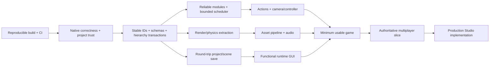

# Implementation-readiness and gap audit

## Readiness verdict

Gargantuan is a promising runtime prototype, not an alpha game platform. The
first milestone must be a small game that uses only supported public APIs and can
be built, run, saved, tested, and packaged without routine native-code changes.
The present repository does not meet that bar.

## Critical dependency chain

The networking schema must influence IDs and property metadata before the
minimum-game work is frozen, but a full multiplayer implementation should follow
a stable local vertical slice. Studio can begin as a diagnostic shell; feature
implementation should wait for the model, save, command, and GUI contracts.

## Required work by foundation

### Build, CI, and developer loop

- Pin and verify dependency revisions; document recursive checkout and generated
  source steps.
- Build Debug and Release on Windows, Linux, and macOS in CI; add a headless test
  target that does not require a GPU.
- Separate libraries (`Core`, `Scripting`, `Scene`, `Physics`, `Render`, `Assets`,
  `Networking`, `Editor`) from executable entry points.
- Make shader compilation optional for headless/test targets and report shader
  failures with filenames and compiler output.
- Add formatting/static analysis, ASan/UBSan where supported, fuzz jobs for
  parsers/native bindings, reproducible packages, and a smoke-test sample.

### Runtime model

- Give every object a stable `ObjectId`; use validated handles rather than raw
  cross-subsystem pointers.
- Make parent/child changes transactional: validate, apply, journal, then publish
  ordered notifications. Reject self-parenting and descendant cycles.
- Make lifecycle state internal and monotonic. `Destroyed` should be read-only;
  destroy must be idempotent and safe under callbacks.
- Create one schema registry containing property type, default, persistence,
  replication, editability, authority, and thread-affinity metadata.
- Preserve the ergonomic public hierarchy while mirroring performance-critical
  state into typed renderer/physics/network stores.

### Scripting

- Complete Instance and filesystem module resolution with canonical identities,
  cycle diagnostics, per-domain caches, and only checked casts.
- Define `Server`, `Client`, `Plugin`, and `EditorTool` execution domains. Give
  each a capability set and isolated globals/module cache; sandbox the root state.
- Validate every native receiver/argument/result, convert C++ failure to a Luau
  error at the boundary, and replace borrowed views with owned values when data
  survives a call.
- Replace recursive/synchronous scheduling hazards with bounded queues, per-script
  budgets, cancellation, ownership, and profiler-visible throttling.
- Specify signal ordering and disconnection semantics; queue mutation events at
  safe points when synchronous re-entry would violate invariants.

### Project, scene, and serialization

- Use a small project manifest plus versioned scene documents with stable IDs and
  explicit references. Define migrations before publishing the format.
- Enforce byte/depth/object/string limits, validate types and array lengths, keep
  unknown fields when safe, and return source-located diagnostics rather than
  uncaught exceptions.
- Save atomically through temporary files and rename; preserve user source files
  and separate generated/imported data.
- Keep the root-confined, bounded `SourceMount` beneath the `FileLink`
  compatibility importer. A future manifest-owned source system still needs
  include rules, client/server/shared execution domains, watching, conflict
  handling, and deterministic mapping before replacing that compatibility surface.
- Add round-trip, corrupted-file, migration, large-scene, and link-escape tests.

### Player-facing runtime

- Correct current mouse bugs, then introduce semantic input actions with device
  bindings, priorities, consumption, focus, rebinding, and gamepad/touch/text.
- Add a normal player camera/controller; freecam becomes a development mode.
- Build an asset importer/resolver/cache for images, meshes, fonts, sounds, and
  scripts. Use content hashes plus logical project aliases.
- Add audio, animation, GUI, collision queries/groups, character controller, and
  a small material/lighting model before claiming general game usability.
- Provide structured diagnostics, script stack traces, performance counters, and
  an in-game/development console.

## API and naming review

The target should feel familiar to Roblox creators without inheriting every
legacy name or behavior. Keep aliases only where they materially reduce adoption
cost.

| Current/familiar name | Recommended canonical name | Reason |
|---|---|---|
| `DataModel` / `game` | `Experience` (`game` compatibility alias) | Describes the running content root; internal `WorldState` may be separate. |
| `Workspace` | `World` | Shorter and avoids confusing runtime space with editor/project workspace. |
| `ReplicatedStorage` | `SharedStorage` | Storage is not itself a replication mechanism; its visibility policy is explicit. |
| `RunService` | `FrameScheduler` | Communicates phases and scheduling rather than a generic service. |
| `UserInputService` | `InputService` plus `ActionMap` | Separates physical input from gameplay actions. |
| `FileLink` | `SourceMount` | Expresses a rooted, policy-controlled mapping rather than a loose path. |
| `RemoteEvent` | `NetworkEvent` | Makes the boundary and one-way semantics explicit. |
| `RemoteFunction` | `NetworkRequest` | A bounded asynchronous request with deadline/cancellation, not a transparent function call. |
| `Content` string | `AssetRef` | Typed, canonical, hash-aware asset identity. |
| Property security levels | `AccessPolicy` and `ExecutionDomain` | Turns decorative metadata into enforceable policy. |
| `ScreenGui` | `ScreenLayer` | A rendered layer/root, not an arbitrary GUI object. |
| `SurfaceGui` / `BillboardGui` | `SurfaceLayer` / `WorldLayer` | Consistent spatial meaning. |

Avoid inventing a bespoke name where the existing one is clear (`Instance`,
`Part`, `Camera`, `Frame`, `Script`, `ModuleScript`, `Vector3`, `CFrame`). Publish
compatibility as a separate adapter package, not branches throughout the engine.

## Documentation claims that do not match source

| Claim or implication | Source-backed reality | Action |
|---|---|---|
| Feature-rich 2D/3D platform | Primitive 3D rendering/physics and a renderer-backed GUI batch/atlas foundation; no complete UI producer. | Reword README around prototype status until exit tests pass. |
| Desktop, mobile, and VR support | SDL desktop-oriented path; no mobile/VR lifecycle, device, input, build, or CI evidence. | List only tested targets and publish a platform matrix. |
| `require` is implemented | Callbacks exist, but Instance path resolution is unfinished and type handling is unsafe. | Reopen roadmap item and add module conformance tests. |
| Roblox compatibility can be enabled | CLI flag is parsed but not consumed; documented spelling/config disagree with code. | Remove claim or implement one canonical compatibility profile and tests. |
| Project configuration is available | Studio config exists but no effective runtime consumer was found. | Define schema, loader, precedence, validation, and diagnostics. |
| `ReplicatedStorage` implies shared client/server content | Its class/source scaffold is not registered; no networking exists. | Rename now or clearly mark it reserved. |
| GUI/Studio sample demonstrates UI | SDL now renders neutral UI batches with atlases, scissors, and blending; retained layout/text/input production is still absent. | Label it a renderer foundation until GUI Foundation 1 pixels and input are tested. |
| Binary Instance format | An enum/value exists; implementation is explicitly absent. | Do not document it as supported. |
| File linking is a development sync workflow | Only an unsafe initial recursive import exists; no watcher or conflict model. | Replace with `SourceMount` contract. |

## “Likely intended” features

These are inferences, not commitments:

- Generated class/service metadata, familiar datatypes, and compatibility docs
  indicate an intent to make Roblox-style Luau content portable.
- Client/server filename suffixes, `ReplicatedStorage`, and security-level fields
  indicate planned execution separation and networking, but there is no working
  authority or replication layer.
- GUI class metadata, the active renderer batch pass, Fluid, SDL_image, and
  SDL_ttf indicate the accepted retained-mode UI/editor direction; semantic
  layout/text/input production remains future work.
- `FileLink`, project manifests, serialization hooks, and the Studio directory
  indicate an intended filesystem-driven editor/source workflow.
- Box3D constraints, contact signals, camera types, mesh enums, and renderer
  passes indicate expansion toward a general scene/game engine.
- Tracy and JSON logging indicate planned profiling/tooling, though no coherent
  diagnostics surface exists yet.

Treat these signals as design input only. Each feature needs an accepted contract,
threat model, tests, and exit criteria before a public compatibility promise.

## Basic-usability definition

The engine is basically usable when a new developer can clone a pinned revision,
run one documented command, open the sample, edit Luau and scene data, see hot
reload or a clear restart loop, play a small game with input/camera/physics/UI/
audio, save and reopen it without drift, receive actionable errors, package a
desktop build, and pass automated smoke tests—without editing engine C++.

The exact acceptance slice is in
[`../FutureArchitecture/MinimumUsableGame.md`](../FutureArchitecture/MinimumUsableGame.md).
