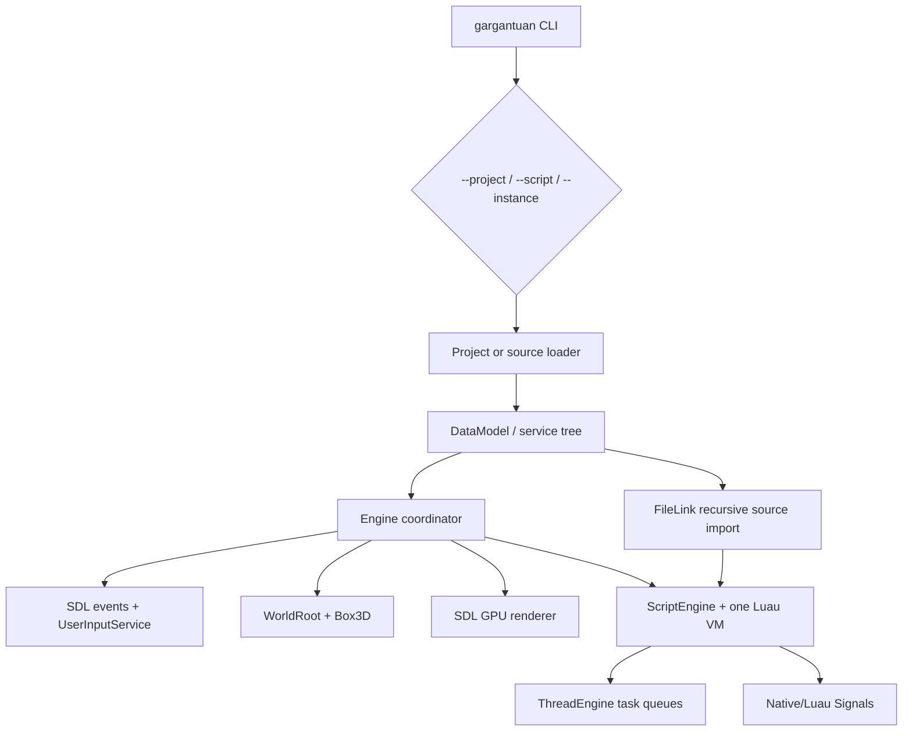
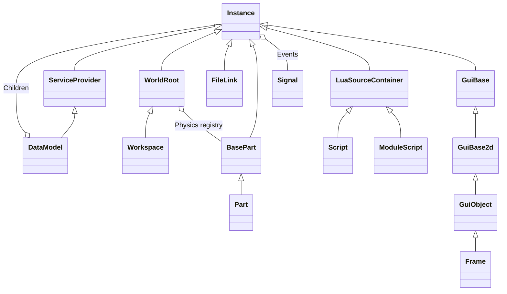
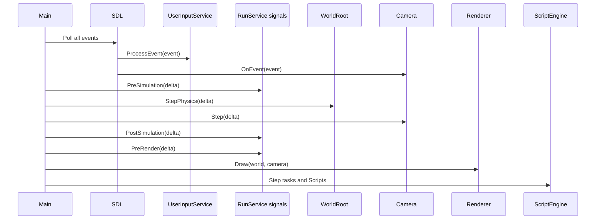

# Current architecture

- [Script security](ScriptSecurity.md) defines enforceable execution domains
  and explicit native-boundary capabilities.
- [Runtime schema](RuntimeSchema.md) defines stable native schema identity, the
  canonical class/member registry, compatibility reflection views, and current
  validation rules.
- [Render extraction](RenderExtraction.md) defines the immutable frame snapshot,
  runtime/editor extraction timing, picking identity, and renderer-owned
  primitive resources.

See [Runtime foundation](./FoundationRuntime.md) for the implemented ownership,
ObjectId, JobSystem, execution-domain, reflection-schema, and committed-change
contracts introduced after the architecture audit.

See [Snapshot baseline](./SnapshotBaseline.md) and
[loopback replication](./LoopbackReplication.md) for the implemented versioned
identity/value formats, snapshot cursor transition, wire journal, and separate
in-process receiver.

See [EditorHost v0](./EditorHostProtocol.md) for the implemented process boundary
between the public MPL-2.0 engine and independently authored Studio clients.

See [Editor viewport v1](./EditorViewport.md) for offscreen frame capture,
camera commands, ObjectId picking, and the future Luau Studio UI service boundary.

## Scope and headline

The current product is one C++23 executable. It owns an SDL window/GPU device (or
a no-op headless renderer), one DataModel, one Luau VM, one Box3D world, and a
single-threaded frame loop. It is closer to an engine testbed than a game
platform. See `CMakeLists.txt:1-199`, `src/Main.cpp:104-187`, and
`src/Engine.cpp:23-143`.

## Application lifecycle

1. `main()` parses three mutually exclusive targets and renderer/logging flags
   (`src/Main.cpp:104-147`).
2. It initializes only SDL events in headless mode, otherwise SDL video and an
   `SDLRenderer` (`src/Main.cpp:150-168`).
3. A loader constructs the DataModel from a project, a standalone script, or an
   Instance file (`src/Main.cpp:26-102`).
4. `Engine` obtains services, binds DataModel descendants, queues Scripts, and
   synchronizes FileLinks (`src/Engine.cpp:23-60`).
5. The loop runs until `ProcessService.Alive` becomes false. Every frame polls
   events, fires simulation hooks, steps Box3D and the camera, draws, and then
   steps scripts (`src/Main.cpp:174-186`, `src/Engine.cpp:73-143`).
6. Shutdown destroys renderer resources and the WorldRoot, then exits the process
   (`src/Engine.cpp:63-67`, `src/Main.cpp:185-187`).

Notable ordering: scripts run after rendering, while `PreSimulation`,
`PostSimulation`, and `PreRender` callbacks run before draw. This means newly
queued regular Scripts do not run until the end of a frame, while signal callbacks
can run synchronously in earlier phases. There is no explicit application state
machine for loading, editing, playing, pausing, stopping, or recovering.

## Runtime object topology

`DataModel` inherits `ServiceProvider`. Services are lazily constructed from a
native definition map; the present DataModel registers only `ProcessService`,
`RunService`, `UserInputService`, and `Workspace`
(`src/classes/DataModel.cpp:9-16`). `Workspace` creates a current Camera
(`src/services/Workspace.cpp:7-9`). A `ReplicatedStorage` class/source scaffold
exists but is not registered, and there is no transport or replication system.

## Frame execution model

Everything shown executes on the main thread. `thread_local` state in
`ScriptEngine.cpp:71` is bookkeeping, not parallel execution. There are no job
workers, render thread, async I/O workers, network threads, or deterministic
simulation lanes.

## Current service set

| Service | Present behavior | Reality check |
|---|---|---|
| `Workspace` | Owns current Camera and inherits `WorldRoot`. | Useful primitive world root; no streaming, raycast API, terrain, characters, or network ownership. |
| `RunService` | Signal container used by `Engine`. | `src/services/RunService.cpp` is empty; semantics are hard-coded in the frame loop. |
| `UserInputService` | Converts a subset of SDL events, tracks keys, emits signals. | Mouse state has map/update bugs and unsupported buttons can throw. No action mapping, gamepads, touch, text input, routing, or UI focus. |
| `ProcessService` | Controls process lifetime and stdout/stderr. | Exposed to every script without a capability check; inappropriate for untrusted experiences. |
| `ReplicatedStorage` | Class/source scaffold only. | Not registered in `DataModel`; the name promises replication that does not exist. |
| `TweenService` | Headers and commented implementation. | Dead/scaffold only; not registered in `DataModel`. |

## Architectural characteristics

- **One process, one world, one VM.** There is no client/server separation.
- **Inheritance plus generated reflection.** Luau files in `assets/classes` and
  `assets/services` are executable build metadata consumed by
  `tools/classgen.luau`; generated headers are expected under
  `include/gargantuan/**/generated` but are not committed.
- **Shared ownership downward, raw ownership upward.** Parents own children with
  `shared_ptr`; children store raw `ParentPointer` (`include/gargantuan/classes/Instance.hpp:19-24`).
- **Synchronous events.** Signals resume callbacks immediately; tasks and Scripts
  share the same VM and host thread.
- **Direct subsystem coupling.** `Engine` knows concrete services, the renderer
  reads `WorldRoot::Parts`, and physics writes Instance properties directly.
- **Local filesystem is part of loading.** Project and FileLink data resolve
  directly to host paths without a capability-oriented asset layer.

## Readiness conclusion

Do not begin a feature-rich Studio on this architecture. A minimal editor shell
may be used as a test client only after Phase 1 contracts exist. Serious Studio
work requires stable object IDs, safe hierarchy transactions, schema-backed
serialization, undoable commands, project trust policy, deterministic change
notifications, a functioning GUI, an asset resolver, and separate edit/play
worlds. These gates are defined in
[`FutureArchitecture/GuiAndStudio.md`](../FutureArchitecture/GuiAndStudio.md).
