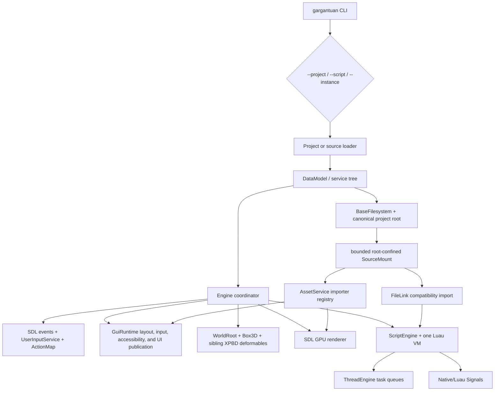
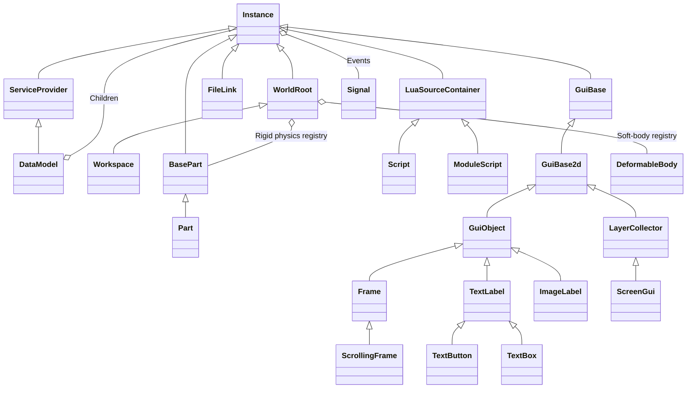
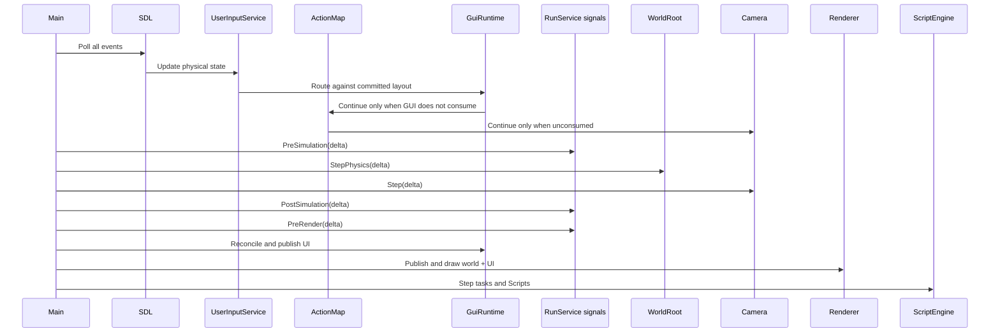

# Current architecture

- [Animation Foundation 1](AnimationFoundation1.md) defines canonical glTF
  skeleton/clip assets, asset-owned Bones, schema-backed Animator plus
  runtime-only tracks, deterministic blending, CPU skinning, renderer-neutral
  pose publication, packaging/headless behavior, limits, and benchmarks.
- [Standalone Packaging Foundation 1](StandalonePackagingFoundation1.md) defines
  ProjectId, immutable GamePayload capture, the canonical RuntimeDistribution,
  strict hashed directory packages, GargantuanPlayer, CLI/EditorHost workflows,
  atomic replacement, and current Windows validation scope.
- [Player runtime](PlayerRuntime.md) defines semantic gameplay input,
  Players/LocalPlayer and character lifetimes, the bounded kinematic query,
  engine-shipped Luau defaults, and custom-controller replacement path.
- [Script security](ScriptSecurity.md) defines enforceable execution domains
  and explicit native-boundary capabilities.
- [Runtime schema](RuntimeSchema.md) defines stable native schema identity, the
  canonical class/member registry, compatibility reflection views, and current
  validation rules.
- [Render extraction](RenderExtraction.md) defines the immutable frame snapshot,
  runtime/editor extraction timing, picking identity, and renderer-owned
  primitive resources.
- [Renderer Foundation 2C](RendererFoundation2C.md) records the two-hardware
  deformable/GUI evaluation, final SDL GPU selection, and GUI start contract.
- [Editor Viewport Presentation Foundation 2](EditorViewportPresentation2.md)
  defines continuous latest-frame production, bounded shared-memory transport,
  generation-safe Edit/Play presentation, and explicit capture fallback.
- [GUI Foundation 1](GuiFoundation1.md) defines the retained screen-space object
  model, deterministic committed layout, text/image resources, routed input,
  accessibility projection, renderer publication, limits, and benchmark.
- [GUI Foundation 2](GuiFoundation2.md) defines epoch-based incremental
  invalidation, sibling stacking contexts, retained display spans, scrolling,
  editable text/IME state, and the measured Foundation 2 performance contract.
- [Asset Foundation 1](AssetFoundation1.md) defines the single public
  `AssetService`, strict stable references, content-addressed image/mesh/font
  artifacts, bounded import/cache behavior, GUI/render residency, persistence,
  Play cloning, and Studio/EditorHost commands.
- [Physics backend](PhysicsBackend.md) defines neutral rigid-body semantics,
  generation-safe physics identity, safe-point updates, and Box3D confinement.
- [Soft-body Physics Foundation 2](SoftBodyPhysicsFoundation2.md) defines the
  bounded independent-body job boundary, deterministic merge/backpressure,
  deformable collider broadphase, improved primitive contacts, rotation-aware
  rubber/volume behavior, and two-machine evidence. [Foundation 1](SoftBodyPhysicsFoundation.md)
  remains the semantic and renderer-integration baseline.
- [Instance attributes](InstanceAttributes.md) defines bounded dynamic state,
  authority, persistence, journal, replication, and Studio contracts.
- [Instance tags](InstanceTags.md) defines scoped indexed membership,
  lifecycle cleanup, deterministic queries, and state-transfer contracts.
- [Attributes + Tags evaluation](AttributesTagsEvaluation.md) records the
  end-to-end decision gate, representative profiles, fixes, and accepted follow-up.
- [Protocol input hardening](ProtocolInputHardening.md) defines the implemented
  bounds, same-scope reference checks, host-owned command origin, atomic batch
  preflight, and notification safe points beneath future networking.
- [Networking foundation validation](NetworkingFoundationValidation.md) maps and
  adversarially revalidates the identity, lifecycle, bounds, sequencing,
  accounting, simulator, and scheduler contracts before a real transport.
- [Real game transport](RealGameTransport.md) defines the optional pinned
  GameNetworkingSockets adapter, handle isolation, lifecycle mapping, private
  compatibility envelope, limits, polling, statistics, and authority boundary.
- [Bounded Luau remotes](LuauRemotes.md) defines schema-backed application
  events and requests, the binary protocol, visibility/deadline/resource
  policy, Luau coroutine boundary, and simulator/GNS verification.
- [SourceMount and FileLink compatibility](SourceMount.md) defines the canonical
  project-root ownership, backend boundary, confinement policy, import limits,
  and transactional replacement lifecycle.
- [Continuous native build and test contract](ContinuousIntegration.md) defines
  the Windows x64 toolchain, fresh-checkout bootstrap, headless CTest gate, and
  explicit CI exclusions.

See [Runtime foundation](./FoundationRuntime.md) for the implemented ownership,
ObjectId, JobSystem, execution-domain, reflection-schema, and committed-change
contracts introduced after the architecture audit.

See [Snapshot baseline](./SnapshotBaseline.md) and
[loopback replication](./LoopbackReplication.md) for the implemented versioned
identity/value formats, snapshot cursor transition, wire journal, and separate
in-process receiver.

See [EditorHost v0](./EditorHostProtocol.md) for the implemented process boundary
between the public MPL-2.0 engine and independently authored Studio clients.

See [Editor viewport capture and picking](./EditorViewport.md) for the explicit
screenshot fallback, camera commands, ObjectId picking, and the Luau Studio UI
service boundary.

See [minimal local Play](./PlaySession.md) for the EditorHost-owned isolated runtime
graph, exact lifecycle identity, diagnostics/input boundary, and teardown contract.

## Scope and headline

The normal runtime is one C++23 executable. It owns an SDL window/GPU device (or
a no-op headless renderer), one DataModel, one Luau VM, one Box3D world, and a
single-threaded frame loop. EditorHost normally owns only its authoring DataModel;
during explicit local Play it additionally owns one separately deserialized runtime
DataModel/VM/Engine until Stop. See `CMakeLists.txt`, `src/Main.cpp`,
`src/Engine.cpp`, and `src/editor/PlaySession.cpp`.

## Application lifecycle

1. `main()` parses three mutually exclusive targets and renderer/logging flags
   (`src/Main.cpp:104-147`).
2. It initializes only SDL events in headless mode, otherwise SDL video and an
   `SDLRenderer` (`src/Main.cpp:150-168`).
3. A loader constructs the DataModel from a project, a standalone script, or an
   Instance file (`src/Main.cpp:26-102`).
4. `Engine` obtains services, creates one SourceMount from the loaded project
   filesystem, binds DataModel descendants, queues Scripts, and synchronizes
   FileLinks through that mount (`src/Engine.cpp`).
5. The loop runs until `ProcessService.Alive` becomes false. Every frame polls
   events, routes normalized input through UserInputService and GUI before
   gameplay actions/camera, fires simulation hooks, steps Box3D and the camera,
   reconciles GUI after `PreRender`, publishes/draws, and then steps scripts
   (`src/Main.cpp`, `src/Engine.cpp`).
6. Shutdown destroys renderer resources and the WorldRoot, then exits the process
   (`src/Engine.cpp:63-67`, `src/Main.cpp:185-187`).

Notable ordering: scripts run after rendering, while `PreSimulation`,
`PostSimulation`, and `PreRender` callbacks run before draw. This means newly
queued regular Scripts do not run until the end of a frame, while signal callbacks
can run synchronously in earlier phases. Normal gameplay has no general application
state machine; EditorHost's minimal Play boundary has only
Stopped/Starting/Running/Stopping/Failed. Pause, debug, and test states do not exist.

## Runtime object topology

`DataModel` inherits `ServiceProvider`. Built-in service classes and their public
API are supplied by the generated Luau schema, while the DataModel's canonical
registration map owns lazy singleton construction and scope. Direct registered
service members and `GetService` share that path; `FindService` only observes an
already-live canonical singleton. The present DataModel registers
`ActionMap`, `AssetService`, `Players`, `ProcessService`, `RunService`, `Tags`,
`UserInputService`, and `Workspace`.
`Workspace` creates a current Camera. A `ReplicatedStorage` class/source scaffold
exists but is not registered. Basic reliable client replication, the production
scheduler, and bounded Luau application remotes now exist as networking
subsystem components. They are not yet wired into a complete multiplayer
executable or final multiplayer `Players` behavior. The deterministic simulator and optional real
GNS adapter exercise both replication and Remote paths.

## Frame execution model

Everything shown except bounded asset decode and independent soft-body jobs
executes on the main thread. `AssetService` owns two `JobSystem` workers for
decode/validation, then commits on the authoritative caller domain; its current
EditorHost request waits synchronously for that bounded worker result. There is
no render thread, async I/O worker, or deterministic simulation lane. When the optional real transport is enabled,
GNS may run its internal service thread; Gargantuan observes its callbacks only
during explicit transport polling.

## Current service set

| Service | Present behavior | Reality check |
|---|---|---|
| `Workspace` | Owns current Camera, neutral rigid physics, the bounded kinematic capsule query, and sibling cloth/rubber deformable physics. | No streaming, broad raycast/overlap API, terrain, soft/self collision, or networked deformation. |
| `RunService` | Signal container used by `Engine`. | `src/services/RunService.cpp` is empty; semantics are hard-coded in the frame loop. |
| `UserInputService` | Owns physical key/button state, pointer delta, focus reset, and mouse/text-input host synchronization, then feeds the retained GUI router. | SDL touch and preedit/committed-text adaptation feed GUI Foundation 2; gamepad publication, candidate UI, complete bidi editing, and physical mobile validation remain incomplete. |
| `ActionMap` | Maps bounded keyboard, mouse-button, and pointer-delta bindings to semantic action state. | Default gamepad bindings and a persisted remapping UI are deferred. |
| `AssetService` | Owns strict stable image/mesh/font references, versioned content-addressed artifacts, bounded import/cache state, runtime resolution, and renderer-neutral residency changes. | Explicit reimport exists; watching, LRU/pins, glTF/materials/audio, packaging, and a full asset browser are deferred. |
| `Players` | Owns one local runtime Player, character relation, and replaceable engine-shipped Luau defaults. | Final server/client membership, transport association, and replication are deferred. |
| `ProcessService` | Controls process lifetime and stdout/stderr. | Process operations require explicit `ProcessControl`; ordinary player runtime scripts are not granted it. |
| `ReplicatedStorage` | Class/source scaffold only. | Not registered in `DataModel`; the name promises replication that does not exist. |
| `TweenService` | Headers and commented implementation. | Dead/scaffold only; not registered in `DataModel`. |

## Architectural characteristics

- **One process, one world, one VM.** There is no client/server separation.
- **Inheritance plus generated reflection.** Luau files in `assets/classes` and
  `assets/services` are executable build metadata consumed by
  `tools/classgen.luau`; generated headers are expected under
  `include/gargantuan/**/generated` but are not committed.
- **Shared ownership downward, raw ownership upward.** Parents own children with
  `shared_ptr`; children store raw `ParentPointer` (`include/gargantuan/classes/Instance.hpp:19-24`).
- **Synchronous events.** Signals resume callbacks immediately; tasks and Scripts
  share the same VM and host thread.
- **Bounded subsystem coupling.** `Engine` knows concrete services. Rigid physics
  publishes post-step transforms through the authoritative setter path, while
  deformables publish engine-owned position/topology values through the immutable
  render-publication path. Box3D and XPBD mechanics remain behind the documented
  [physics backend](PhysicsBackend.md) and
  [soft-body](SoftBodyPhysicsFoundation.md) boundaries.
- **Project filesystem and source policy are separate layers.** `BaseFilesystem`
  is the engine backend. FileLink source access is confined by one canonical,
  bounded `SourceMount`; project trust prompts and a capability-oriented asset
  layer remain deferred.

## Readiness conclusion

Do not begin a feature-rich Studio on this architecture. A minimal editor shell
may be used as a test client only after Phase 1 contracts exist. Serious Studio
work requires stable object IDs, safe hierarchy transactions, schema-backed
serialization, undoable commands, project trust policy, deterministic change
notifications, a functioning GUI, an asset resolver, and separate edit/play
worlds. These gates are defined in
[`FutureArchitecture/GuiAndStudio.md`](../FutureArchitecture/GuiAndStudio.md).
