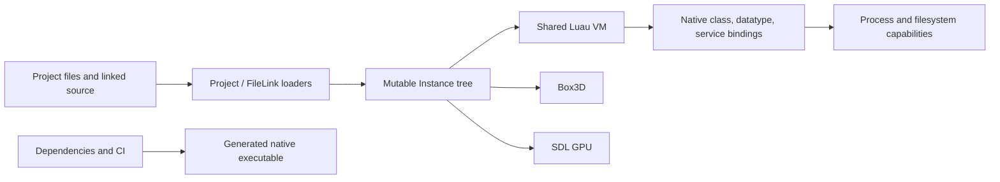

# Security audit

## Scope and interpretation

The original audit covered repository commit
`e4fca3575cc84c0d5fa4a946b88bf528aac2223b`. This document was reconciled on
2026-08-13 against current `main` plus the WorldRoot hardening in this change.
This is not a new exhaustive audit: each original finding was checked against
current implementation and tests, and stale evidence was corrected.

Across the 33 validated findings, 10 are resolved, 4 are partially resolved,
and 19 remain open. Across the 14 original proof-needed candidates, 2 are now
resolved, 11 remain deferred, and 1 is no longer applicable. Overall status
counts are therefore: **Resolved 12**, **Partially resolved 4**,
**Still open 19**, **Deferred 11**, and **No longer applicable 1**.

Severity describes the current local prototype boundary, not a future networked
service. “High” generally means a trusted-looking project/source operation can
produce host file access or native memory/type unsafety. Some low findings become
high after untrusted multiplayer content or third-party plugins are supported.

This was a static audit with partial dynamic coverage. It is not proof of absence.
No dependency-CVE conclusion is made because dependencies were not resolved and
built in the audit checkout.

## Trust boundaries found today

The most important issue is not one bug: local content crosses from project files
through native parsers and Luau into powerful host services without a coherent
trust decision or capability boundary.

## Validated findings

### High severity

| ID | Status | Current evidence and remaining action |
|---|---|---|
| SEC-001 | Still open | `src/classes/FileLink.cpp` and normal `Engine` project startup still lack a canonical project trust/confinement boundary. EditorHost avoids execution but does not close the game-runtime path. |
| SEC-002 | Resolved | `InstanceSerialization::TryDeserializeProperty` materializes JSON strings as owned `std::string`; regression coverage exercises nested project loading. Retained Luau-origin `string_view` properties remain tracked separately in the deferred table. |
| SEC-003 | Resolved | `src/scripting/ModuleResolution.cpp` uses `dynamic_pointer_cast<ModuleScript>` and wrong-type tests in `FoundationTests.cpp` require rejection. |
| SEC-004 | Resolved | `src/runtime/DataModelRoot.cpp::PrepareDataModelRoot` checks `DataModel` and otherwise parents a standalone root beneath `Workspace`; both paths have foundation coverage. |
| SEC-005 | Resolved | `Instance::ParentReference` is a `weak_ptr`; parenting rejects cycles and destruction detaches monotonically. Lifetime, cycle, and reentrant-destroy tests cover the contract. |

### Medium severity

| ID | Status | Current evidence and remaining action |
|---|---|---|
| SEC-006 | Partially resolved | `MutationGateway`, `ExecutionDomain`, property write authority, and write permissions protect committed mutation. Read access and method dispatch still lack a complete deny-by-default access policy. |
| SEC-007 | Still open | `StackValue<glm::vec3>::From` still calls `lua_tovector`; callers do not uniformly enforce `Is` before conversion. Central argument decoding remains required. |
| SEC-008 | Still open | Several `InstanceSerialization` array decoders validate only `is_array()` before indexing. Add exact/minimum lengths and fuzz/property-tag tests. |
| SEC-009 | Resolved | `WorldRoot::CreateConstraintJoint` now rejects missing, dead, self, cross-world, and invalid-handle endpoints before joint construction; focused tests cover missing and valid endpoints. |
| SEC-010 | Still open | Tagged userdata lookup improved receiver rejection, but `UserdataMethod::CallFromMember` still converts positional arguments without central arity/type validation. |
| SEC-011 | Still open | Enum conversion still needs explicit enum-type identity checks at every typed boundary. |
| SEC-012 | Partially resolved | `InvokeNativeCallback` contains C++ exceptions for Instance and generic userdata dispatch, with regression coverage. Manually registered library/service callbacks are not yet uniformly wrapped. |
| SEC-013 | Resolved | `Destroyed` is read-only in generated metadata; `Destroy()` commits state before callbacks and is monotonic, reentrant-safe, and idempotent under tests. |
| SEC-014 | Still open | `ThreadEngine`, `Signal`, `Script`, and source-load diagnostics still call `lua_tostring` directly for arbitrary Luau errors. Add a total-value formatter. |

### Low severity

| ID | Status | Current evidence and remaining action |
|---|---|---|
| SEC-015 | Still open | `DataModel::GetServiceDefinitions` still exposes `ProcessService` to the normal experience service tree. |
| SEC-016 | Resolved | `Instance::SetParent` rejects self-parenting and descendant cycles before mutation; rejected operations emit no journal records under tests. |
| SEC-017 | Still open | Recursive project Instance JSON still has no explicit byte, depth, object, or aggregate allocation budget. |
| SEC-018 | Still open | Script, task, and signal admission/execution quotas remain absent. The native `JobSystem` does not govern arbitrary Luau execution. |
| SEC-019 | Partially resolved | `JobSystem` has groups, draining shutdown, and exception containment. Luau `ThreadEngine` tasks still lack owner cancellation and queue bounds. |
| SEC-020 | Still open | `ThreadEngine::Step` swaps batches but continues until `DeferredQueue` is empty, so a replenishing defer chain can monopolize the step. |
| SEC-021 | Resolved | `BaseFilesystem` copy/move paths use owned buffers and explicit success/byte-count handling; filesystem regression tests cover the corrected behavior. |
| SEC-022 | Still open | `StackValue<std::vector<T>>::From` still resizes then appends while iterating and does not validate a dense, correctly typed table first. |
| SEC-023 | Still open | Source threads call `luaL_sandboxthread`, but the root Luau state still has no demonstrated least-privilege sandbox initialization. |
| SEC-024 | Still open | EditorHost opens documents without execution, but normal CLI/Engine project startup still queues source without an explicit persisted trust decision. |
| SEC-025 | Still open | The project TOML writer still needs a conforming encoder or comprehensive escaping and round-trip fuzz coverage. |
| SEC-026 | Still open | `task.spawn` still resumes directly; enqueue-only scheduling and owner/frame budgets remain required. |
| SEC-027 | Partially resolved | EditorHost and snapshot/wire parsers contain exceptions and fail closed, and project loading returns structured errors in many paths. Legacy Instance JSON still uses unchecked field/index access in places. |
| SEC-028 | Still open | Unsupported mouse buttons need explicit `find`/ignore behavior throughout event conversion; no focused regression currently proves total handling. |
| SEC-029 | Resolved | `Instance::Destroy` commits `DestroyingState` and `Destroyed` before callbacks, invalidates identity predictably, and ignores reentrant/repeat calls under tests. |
| SEC-030 | Still open | Signals snapshot some callback state, but hierarchy notifications still execute synchronously around multi-object mutation without a general transaction/safe-point contract. |
| SEC-031 | Still open | Renderer and physics scene admission/degradation budgets remain future work. |
| SEC-032 | Still open | Signal connections/waiters remain unbounded and teardown ownership is incomplete. |
| SEC-033 | Resolved | `BaseFilesystem::ReadFileToString` reads into owned capacity and shrinks to the actual byte count, preventing overwrite after a size race; filesystem tests cover mutable-size behavior. |

## Deferred findings requiring runtime proof

These candidates are credible enough to test, but the static audit could not
establish a complete reachable exploit or invariant violation:

| Candidate | Status | Current evidence or proof still needed |
|---|---|---|
| GPU mesh transfer/failure paths | Deferred | Force every SDL GPU allocation/upload failure and inspect partial teardown under a real backend. |
| Shared custom globals across sandboxed threads | Deferred | Demonstrate cross-domain mutation or prove privileged globals cannot be replaced. |
| TOML parser recursive/nesting exhaustion | Deferred | Benchmark and fuzz deeply nested valid/invalid input with production parser settings. |
| Signal callbacks retain a raw Luau VM pointer | Deferred | Destroy VM/owners in each order under ASan and invoke/disconnect pending callbacks. |
| Reflection base-pointer reinterpretation | Deferred | Generate or manually register a mismatched class and prove whether dispatch reaches an invalid base. |
| Descendant-removal static casts | Resolved | `WorldRoot` now uses checked `dynamic_pointer_cast` paths; removing an unrelated `Folder` is covered without entering physics teardown. |
| Reentrant ancestry callbacks observe corrupt state | Deferred | Construct callbacks that reparent/destroy during every notification phase and assert tree invariants. |
| Property `string_view` values retained from Luau | Deferred | Generated properties such as `UserInputService::MouseIcon` still retain views; prove lifetime under collection or replace them with owned strings. |
| Module cache keyed by raw address identity | No longer applicable | Current module resolution has no engine-side raw-address module cache; stable `ObjectId` is used for cross-subsystem object identity. Reassess if a cache is introduced. |
| Project Studio lock lacks content hash | Deferred | The legacy in-engine Studio was removed, but project/package integrity policy remains undefined for future Studio workflows. |
| Invalid Part dimensions reach Box3D | Deferred | Fuzz NaN, infinity, negative, zero, and huge values against the linked Box3D revision. |
| Vector2 arithmetic segfault note | Deferred | Re-enable the disabled test under ASan and minimize the crash. |
| Constraints resolve `Part1` through `Part0` path | Resolved | `WeldConstraint::GetActiveParts` now reads `Part1`; focused valid-distinct-endpoint coverage verifies the correction. |
| Script coroutine registry reference uses/leaks wrong stack slot | Deferred | Repeatedly start/fail/collect Scripts and inspect registry growth and resumed object identity. |

Deferred does not mean safe. Each belongs in the pre-alpha verification backlog.

## Defense-in-depth and supply-chain hardening

- Pin GitHub Actions to immutable commit SHAs, reduce workflow permissions, and
  separate Pages deployment from build validation.
- Avoid documentation that pipes a mutable remote installer directly to a shell;
  publish checksums/signatures and a reviewable download step.
- Neutralize terminal control characters in project/script-originated log fields.
- Treat class-generation metadata as trusted executable build input. If plugins
  can supply it later, isolate generation and constrain output paths.
- Add dependency inventory/SBOM, vulnerability alerts, signed releases, artifact
  provenance, and reproducible build notes.
- Keep secrets and service credentials out of all Instance trees, client builds,
  logs, replication state, and project files.

## Security release gates

Do not open arbitrary downloaded projects until SEC-001 through SEC-014 are fixed
and regression-tested. Do not enable public multiplayer until the future threat
model, authority checks, schema validation, rate limits, fuzzing, and operational
abuse controls in
[`../FutureArchitecture/NetworkingAndSecurity.md`](../FutureArchitecture/NetworkingAndSecurity.md)
are implemented. Do not enable third-party Studio plugins in-process; start with
an isolated capability broker.

Recommended automated gates:

1. ASan/UBSan native and Luau-binding tests on every change.
2. Coverage-guided fuzzing for JSON/TOML/project/module/native argument surfaces.
3. Property-based hierarchy and serialization round-trip tests.
4. Scheduler, signal, scene-size, and allocation budget tests.
5. Path traversal/symlink/junction tests on every supported host platform.
6. Network protocol fuzzing and malicious-client simulations before public use.
7. A release threat-model review whenever a new execution domain or host
   capability is introduced.
