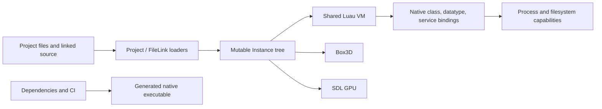

# Security audit

## Scope and interpretation

This audit covers the repository at
`e4fca3575cc84c0d5fa4a946b88bf528aac2223b`, including native code, Luau
bindings, parsers, project loading, renderer/physics boundaries, build tooling,
tests, and GitHub workflows. A repeated independent discovery pass produced 59
candidates. Validation and attack-path review retained 33 source-backed findings:
5 high, 9 medium, and 19 low. Fourteen additional candidates remain deferred
because reachability or lifetime behavior needs runtime proof. Twelve were
suppressed as non-vulnerabilities, unreachable developer-tool risks, or general
hardening only.

Severity describes the current local prototype boundary, not a future networked
service. “High” generally means a trusted-looking project/source operation can
produce host file access or native memory/type unsafety. Some low findings become
high after untrusted multiplayer content or third-party plugins are supported.

This was a static audit with partial dynamic coverage. It is not proof of absence.
No dependency-CVE conclusion is made because dependencies were not resolved and
built in the audit checkout.

## Trust boundaries found today

The most important issue is not one bug: local content crosses from project files
through native parsers and Luau into powerful host services without a coherent
trust decision or capability boundary.

## Validated findings

### High severity

| ID | Finding | Evidence area | Required fix |
|---|---|---|---|
| SEC-001 | `FileLink` does not confine resolved paths and recursively imports executable source. A project can escape its intended root and cause host files with recognized suffixes to be read/run. | `src/classes/FileLink.cpp`, `src/Engine.cpp` | Canonicalize against a granted root, reject absolute/traversal/link escapes, impose recursion/file limits, and require project trust before execution. |
| SEC-002 | Deserialization retains a `string_view` derived from temporary/replaceable JSON storage, creating a dangling native view. | Instance JSON deserializer sources | Store owned strings across parse steps; add ASan tests covering nested and failing documents. |
| SEC-003 | Module loading statically downcasts the object found by `require` to `ModuleScript`. A path resolving to another class can cause native type confusion. | `src/script/ScriptEngine.cpp` require callbacks | Use checked class identity/casts and return a Luau error for invalid targets; test every wrong-type path. |
| SEC-004 | Standalone Instance loading statically treats the loaded root as `DataModel`, making the fallback unsafe/unreachable for other root classes. | `src/Main.cpp` | Check the root type, explicitly wrap a non-DataModel root, and test each CLI target. |
| SEC-005 | Children retain a raw `ParentPointer`; parent collection/destruction can leave a dangling pointer reachable through child operations. | `include/gargantuan/classes/Instance.hpp`, Instance lifecycle sources | Replace with validated handle/weak ownership, define detach-before-destroy ordering, and add sanitizer lifetime tests. |

### Medium severity

| ID | Finding | Evidence area | Required fix |
|---|---|---|---|
| SEC-006 | Declared property/method security levels are not enforced by dispatch. | generated reflection/binding path | Enforce an `ExecutionDomain`/`AccessPolicy` at every call and property access; deny by default. |
| SEC-007 | Generated vector conversion uses `lua_tovector` without proving the value has the expected vector representation. | generated bindings and `Vector3` conversion | Check Luau type/tag and arity before conversion; return a normal script error. |
| SEC-008 | Short JSON arrays are indexed without validating their length. | property datatype deserializers | Require exact/minimum lengths before indexing; fuzz all property tags. |
| SEC-009 | Constraint creation accepts missing or inconsistent endpoint state. | constraint/WorldRoot physics integration | Validate both parts, world membership, non-self constraints, and body handles before constructing a joint. |
| SEC-010 | Native userdata dispatch can accept an invalid receiver or insufficient/wrong arguments. | datatype/class binding dispatchers | Centralize checked receiver and argument decoding; never reinterpret unchecked userdata. |
| SEC-011 | Cross-enum operations can accept an enum item of the wrong enum type, producing type confusion at the API boundary. | enum Luau bindings | Compare enum type identity as well as item representation before conversion. |
| SEC-012 | C++ exceptions can escape Luau C callbacks. | native binding and service callbacks | Catch at every callback boundary, translate to structured Luau errors, and test exception paths. |
| SEC-013 | `Destroyed` is ordinary script-writable state, so scripts can forge lifecycle state and violate native assumptions. | Instance metadata/lifecycle | Make lifecycle internal and expose a read-only query; ensure destruction is monotonic and idempotent. |
| SEC-014 | Non-string Luau error values can be converted through a null C string on native error paths. | script resume/error reporting | Use a safe error formatter for every Luau value type and a fallback message. |

### Low severity

| ID | Finding | Evidence area | Required fix |
|---|---|---|---|
| SEC-015 | Every script can reach `ProcessService`, including process termination and host output. | `src/classes/DataModel.cpp`, ProcessService bindings | Remove it from experience domains; expose a narrow application capability only to trusted hosts/tools. |
| SEC-016 | Parent cycles are not rejected and can cause recursion, leaks, or non-terminating traversal. | Instance parenting | Validate acyclicity before mutation and cap defensive traversal depth. |
| SEC-017 | Recursive Instance JSON has no effective byte/depth/object limits. | serialization/deserialization | Apply total and per-field budgets before allocation/recursion. |
| SEC-018 | Scripts, tasks, and signals have no admission or execution quotas. | ScriptEngine/ThreadEngine/Signal | Budget by domain/script and frame; cap queues/connections and surface throttling. |
| SEC-019 | Scheduled tasks have no cancellation/ownership and can survive invalid owners or overload the loop. | ThreadEngine | Add owned cancellation tokens, queue limits, deadline policy, and shutdown draining. |
| SEC-020 | A self-replenishing `task.defer` chain can keep the scheduler in the same step indefinitely. | ThreadEngine defer processing | Swap bounded phase queues and defer newly queued work to the next frame. |
| SEC-021 | Filesystem copy/move error paths can use an uninitialized pointer and delete after a failed transfer. | BaseFilesystem implementation | Initialize ownership explicitly, branch on operation success, and use RAII. |
| SEC-022 | Table-to-vector conversion mixes allocation/conversion assumptions and can mishandle malformed tables. | datatype Luau conversion | Validate shape/types first and construct into owned, initialized storage. |
| SEC-023 | The main Luau state is not root-sandboxed before custom environments are created. | `src/script/ScriptEngine.cpp` | Sandbox the root state, then construct least-privilege domain environments. |
| SEC-024 | Projects open and queue source automatically without an explicit trust gate. | CLI/Engine project load | Default new/downloaded projects to restricted mode; record trust per canonical project identity. |
| SEC-025 | TOML serialization does not safely encode all user-controlled key/value forms. | TOML serializer | Use a conforming encoder or rigorously quote/escape keys and values; round-trip fuzz. |
| SEC-026 | Recursive `task.spawn` can grow the native call stack. | ThreadEngine | Make spawn enqueue-only and enforce per-frame/per-owner budgets. |
| SEC-027 | Nested JSON type mismatches can throw uncaught exceptions and terminate loading. | JSON deserializers | Use checked access with path-aware diagnostics; contain exceptions at the document boundary. |
| SEC-028 | Unsupported SDL mouse buttons are looked up with a throwing map access. | `src/services/UserInputService.cpp` | Treat unknown inputs as `Unknown` or ignore with a rate-limited diagnostic. |
| SEC-029 | `Destroy()` is reentrant before destroyed state is committed. | Instance lifecycle | Transition atomically to `Destroying`, detach safely, then notify; make repeat calls harmless. |
| SEC-030 | User Signals permit unsafe reentrant mutation while native invariants are mid-update. | Signal implementation and hierarchy/property callers | Define safe points; snapshot callbacks and queue invariant-sensitive notifications. |
| SEC-031 | Very large scenes impose persistent per-frame renderer/physics work with no admission or degradation policy. | Engine, renderer, WorldRoot | Enforce scene budgets and add culling, sleeping, streaming, profiling, and graceful limits. |
| SEC-032 | Signal connections and waiters are unbounded and have incomplete teardown ownership. | Signal implementation | Cap/attribute registrations and disconnect all waiters on owner/VM destruction. |
| SEC-033 | `ReadFileToString` sizes then reads a mutable file without defending against a size race. | filesystem utility | Use a bounded streaming read or verify actual bytes/size safely; never write past allocated storage. |

## Deferred findings requiring runtime proof

These candidates are credible enough to test, but the static audit could not
establish a complete reachable exploit or invariant violation:

| Candidate | Proof needed |
|---|---|
| GPU mesh transfer/failure paths | Force every SDL GPU allocation/upload failure and inspect null/partial teardown under a real backend. |
| Shared custom globals across sandboxed threads | Demonstrate cross-domain mutation after the proposed domains exist, or prove current scripts can replace privileged values. |
| TOML parser recursive/nesting exhaustion | Benchmark and fuzz deeply nested valid/invalid input with production parser settings. |
| Signal callbacks retain a raw Luau VM pointer | Destroy VM/owners in each order under ASan and invoke/disconnect pending callbacks. |
| Reflection base-pointer reinterpretation | Generate or manually register a mismatched class and show dispatch reaches the invalid base. |
| Descendant-removal static casts | Produce each possible descendant class and prove the cast result is dereferenced unsafely. |
| Reentrant ancestry callbacks observe corrupt state | Construct callbacks that reparent/destroy during each notification phase and assert tree invariants. |
| Property `string_view` values retained from Luau | Force collection/mutation after assignment and inspect native storage under ASan. |
| Module cache keyed by raw address identity | Force object destruction/address reuse and show a stale module result crosses identities. |
| Project Studio lock lacks content hash | Demonstrate a realistic package/submodule substitution path in the intended distribution flow. |
| Invalid Part dimensions reach Box3D | Fuzz NaN, infinity, negative, zero, and huge values against the linked Box3D revision. |
| Vector2 arithmetic segfault note | Re-enable the disabled test under ASan and minimize the crash. |
| Constraints resolve `Part1` through `Part0` path | Exercise unequal endpoints and determine whether this is correctness-only or unsafe handle use. |
| Script coroutine registry reference uses/leaks wrong stack slot | Repeatedly start/fail/collect Scripts and inspect registry growth and resumed object identity. |

Deferred does not mean safe. Each belongs in the pre-alpha verification backlog.

## Defense-in-depth and supply-chain hardening

- Pin GitHub Actions to immutable commit SHAs, reduce workflow permissions, and
  separate Pages deployment from build validation.
- Avoid documentation that pipes a mutable remote installer directly to a shell;
  publish checksums/signatures and a reviewable download step.
- Neutralize terminal control characters in project/script-originated log fields.
- Treat class-generation metadata as trusted executable build input. If plugins
  can supply it later, isolate generation and constrain output paths.
- Add dependency inventory/SBOM, vulnerability alerts, signed releases, artifact
  provenance, and reproducible build notes.
- Keep secrets and service credentials out of all Instance trees, client builds,
  logs, replication state, and project files.

## Security release gates

Do not open arbitrary downloaded projects until SEC-001 through SEC-014 are fixed
and regression-tested. Do not enable public multiplayer until the future threat
model, authority checks, schema validation, rate limits, fuzzing, and operational
abuse controls in
[`../FutureArchitecture/NetworkingAndSecurity.md`](../FutureArchitecture/NetworkingAndSecurity.md)
are implemented. Do not enable third-party Studio plugins in-process; start with
an isolated capability broker.

Recommended automated gates:

1. ASan/UBSan native and Luau-binding tests on every change.
2. Coverage-guided fuzzing for JSON/TOML/project/module/native argument surfaces.
3. Property-based hierarchy and serialization round-trip tests.
4. Scheduler, signal, scene-size, and allocation budget tests.
5. Path traversal/symlink/junction tests on every supported host platform.
6. Network protocol fuzzing and malicious-client simulations before public use.
7. A release threat-model review whenever a new execution domain or host
   capability is introduced.
