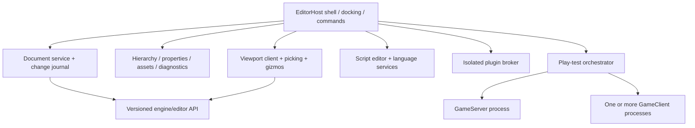

# GUI and Studio architecture

## Runtime GUI contract

Build one retained-mode GUI system used by games and by ordinary Studio panels
where practical. It must have independent layout, presentation, and input stages;
no widget should submit GPU work or poll SDL directly.

```mermaid
flowchart LR
    Tree["UI Instance tree"] --> Style["Style + theme resolution"]
    Style --> Layout["Measure and arrange"]
    Layout --> Display["Clipped display list"]
    Display --> Batch["Text/image/vector batches"]
    Batch --> GPU["UI render pass"]
    Devices["Platform input"] --> Actions["InputService + actions"]
    Actions --> Hit["Hit test + focus router"]
    Hit --> Events["Capture / target / bubble events"]
    Events --> Tree
```

### Core layers and primitives

- `ScreenLayer`: screen-space root with safe areas, display order, modal/focus
  scope, scaling policy, and accessibility root.
- `SurfaceLayer`: UI mapped to a scene surface with explicit resolution and input
  projection.
- `WorldLayer`: camera-facing or world-oriented UI with distance/occlusion policy.
- `Frame`, `Text`, `Image`, `Button`, `TextInput`, `ScrollView`, and `Viewport` as
  small composable primitives rather than a large legacy widget inheritance tree.
- `StackLayout`, `GridLayout`, `FlexLayout`, padding/aspect/size constraints, and
  content measurement. Use scale/offset dimensions only as compatibility sugar
  over a coherent constraint system.

The style layer supports tokens, classes/variants, inherited text/style values,
local overrides, state selectors, and theme switching. Layout uses deterministic
measure/arrange passes with dirty-region propagation and cycle diagnostics.
Rendering produces an immutable display list with clipping, transforms, opacity,
z-order, off-screen caching, atlas references, and stable batch keys.

### Text, images, and rendering requirements

- Unicode shaping, bidirectional text, grapheme-aware selection, fallback fonts,
  wrapping/truncation, IME, and high-DPI rasterization;
- content-addressed image/font assets, nine-slice, tiling, color transforms, and
  placeholders/errors;
- nested rectangular and rounded clipping, masks only when supported/budgeted;
- alpha-correct ordering and a defined color space;
- viewport resize/device-loss recovery and backend-independent render tests; and
- performance budgets for node count, layout time, glyph/image cache, vertices,
  draw calls, and invalidation storms.

### Input, focus, and accessibility

Platform events become normalized physical inputs, then semantic actions. The UI
router hit-tests the committed layout snapshot and dispatches capture, target, and
bubble phases. Events can be handled/consumed without corrupting global key state.
Pointer capture, hover, drag, modal scopes, keyboard/gamepad navigation, tab order,
focus restoration, text composition, and touch gestures must be explicit.

Expose accessible role/name/value/state, logical reading order, reduced motion,
contrast/theme hooks, scalable text, and localization-ready text direction. These
are foundation contracts, not late widget polish.

## Studio boundary

Studio should be an `EditorHost` application that uses versioned engine APIs and
orchestrates separate edit, server, and client worlds. It owns documents and
commands; the runtime owns valid scene state.

### Editor data model

An editor command is the only normal mutation entry point. It declares its target
document, validates against schemas, produces an atomic change set, and contains
enough inverse or snapshot information for undo. The same ordered journal drives
panel refresh, scene rendering, autosave, collaboration later, and optional live
edit replication.

Documents have stable IDs, dirty state, base revision/hash, migrations, atomic
save, external-change detection, and recovery snapshots. Edit state—selection,
expanded tree nodes, viewport camera, breakpoints—is stored separately from game
scene state.

### Minimum Studio feature order

1. Project launcher/trust view, build status, and structured diagnostics.
2. Read-only scene viewport, hierarchy, and property inspection.
3. Selection/picking, transform gizmos, schema-driven property editing, command
   history, undo/redo, dirty state, and atomic save.
4. Luau editor with parser/type analysis, module navigation, completion,
   diagnostics, formatting, and source-to-runtime stack locations.
5. Complete the Asset Foundation 1 Studio seam with a browsable asset panel,
   thumbnails, drag/drop copy-in, reimport/delete selection, and property assignment.
6. Local server/client play, pause/stop, multiple clients, isolated logs/profilers,
   and edit-world restoration.
7. GUI layout inspection and device/safe-area emulation.
8. Capability-declared plugins and optional collaborative workflows.

Do not start with a visual clone of Roblox Studio. A familiar three-panel shell is
cheap; safe document semantics, diagnostics, and edit/play isolation are the work
that determines whether the editor survives real projects.

## Gates before serious Studio implementation

All of the following must be demonstrated through engine APIs:

- stable object/document IDs and generation-checked references;
- schema discovery for class creation, properties, events, editability, and
  validation, without executing arbitrary metadata in Studio;
- transactional hierarchy/property changes with ordered journal entries;
- safe round-trip serialization, migrations, atomic save, and source mounts;
- render extraction, object picking IDs, camera control, and resize/device-loss
  behavior;
- working runtime GUI layout/render/input/text primitives;
- deterministic edit-world cloning into a separate play server/client;
- structured diagnostics, script source maps, stack traces, profiling, and logs;
- asset identity/import/cache APIs (Foundation 1 complete; browser UX and
  asynchronous progress remain); and
- project trust plus an isolated plugin capability broker.

Until these pass, Studio work should be limited to a diagnostic harness that
helps validate the runtime—not a user-facing implementation commitment.

## Editor security

Opening is not executing. Studio first parses a bounded manifest, shows requested
capabilities and source mounts, and remains restricted until trust is granted.
File access goes through document/source-mount brokers rooted to the project.
Imports/builds/plugins run in separate restricted workers. The editor never puts
deployment secrets into the project or client play process.

Plugin manifests declare filesystem roots, network origins, project document
access, UI contributions, and process/native-code needs. Native code is denied by
default. Permissions are user-visible, revocable, version-sensitive, and logged.

## GUI and Studio testing

- golden layout/display-list tests at multiple DPI, locales, and viewport sizes;
- render image comparisons with tolerance plus backend smoke tests;
- randomized layout/property/input sequences with invariant checks;
- keyboard/gamepad/touch focus-navigation and accessibility-tree tests;
- document save/reopen/migration/external-conflict/recovery tests;
- command undo/redo property tests and selection stability across changes;
- multi-process play tests proving edit-world isolation and cleanup; and
- malicious project/import/plugin corpora under sandbox, sanitizer, and resource
  budgets.
