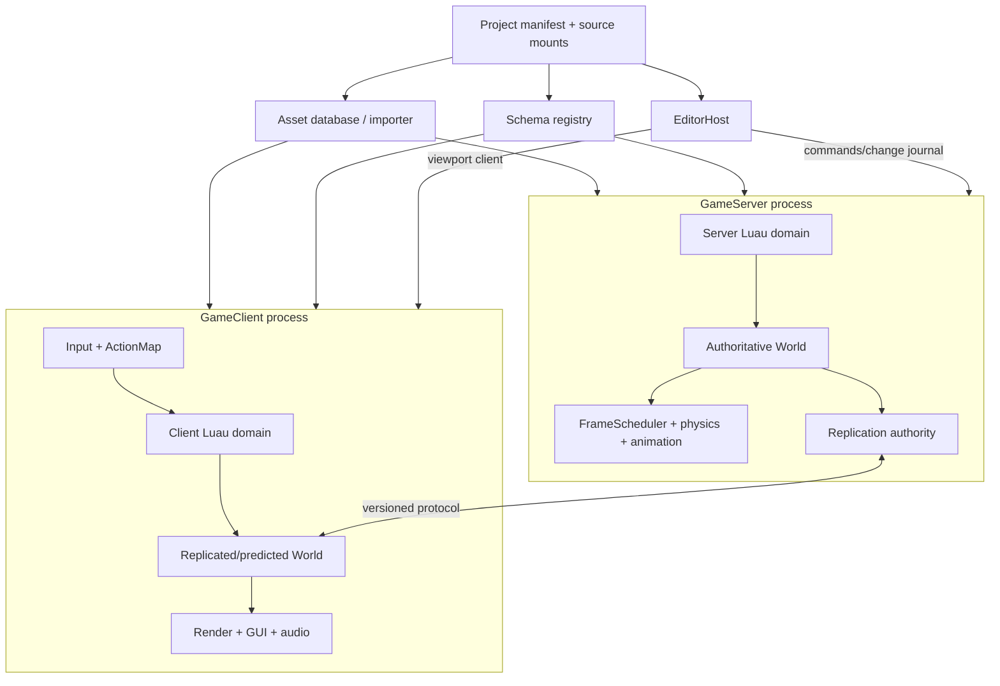
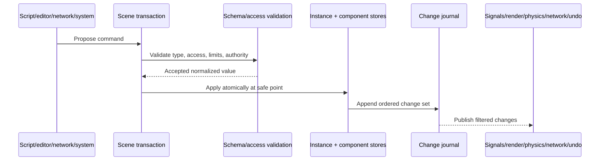

# Future architecture

## Product target

Gargantuan should provide roughly the productive 90% of a contemporary
Roblox-like workflow: hierarchical objects, Luau, authoritative multiplayer,
events and requests, reusable assets, physics, animation, audio, retained-mode
GUI, scene editing, play testing, packaging, and self-hosting. It should not chase
deprecated APIs, historical quirks, or exact bug compatibility.

The defining freedom is deployment and composition: developers can self-host
servers and services, own source/assets, extend tooling through explicit
capabilities, and choose compatibility adapters without weakening the core.

## Design principles

1. **Server authority is structural.** API shape, schemas, and process roles make
   unsafe client trust difficult.
2. **One public object model, specialized internal stores.** Instances remain the
   approachable authoring/script model; render, physics, animation, and network
   systems consume validated snapshots/components keyed by stable IDs.
3. **Capabilities replace ambient authority.** Execution domains receive only the
   filesystem, process, network, editor, and asset operations they need.
4. **Schemas are executable contracts.** Persistence, replication, editability,
   access, validation, and migration live in one registry.
5. **Changes are journaled.** Transactions feed signals, undo/redo, live editing,
   replication, diagnostics, and replay without observing partial mutation.
6. **Budgets are part of every API.** CPU, memory, objects, tasks, signals, asset
   bytes, network bytes, and queue depth are observable and enforceable.
7. **Offline and online share the same contracts.** Local play runs the same
   server/client protocol, initially on loopback, to prevent a second game model.
8. **Compatibility is layered.** A versioned adapter package provides familiar
   aliases/behavior; core code stays coherent and modern.
9. **Tooling uses supported APIs.** Studio is a demanding client of the engine,
   not a privileged collection of internal pointer accesses.

## Proposed runtime topology

Use separate client and server processes for production and final play tests.
During early development a local orchestration command may launch both and stream
their logs into one console. An in-process mode is acceptable only for fast unit
tests where isolation behavior is not under test.

## Core modules and ownership

| Module | Owns | Does not own |
|---|---|---|
| `Core` | IDs/handles, diagnostics, time, jobs, memory/budget primitives | Gameplay objects or platform UI |
| `Schema` | Class/property/event definitions, validation, migration, access flags | Instance storage or transport |
| `Scene` | Instance registry, hierarchy transactions, change journal, tags/queries | GPU/Box3D native objects |
| `Scripting` | Luau domains, module graph, scheduler, native binding validation | Host capabilities not explicitly granted |
| `Assets` | Importers, hashes, aliases, dependency graph, cache, package manifests | Scene lifecycle |
| `Simulation` | Fixed phases, physics/animation command and event buffers | UI layout or network sockets |
| `Networking` | Sessions, protocol, replication, RPC, interest, budgets | Gameplay authority decisions |
| `Presentation` | Render graph, materials, lighting, UI compositor, audio | Authoritative gameplay state |
| `Platform` | Window, input devices, filesystem broker, sockets, clocks | Game policy |
| `Editor` | Commands, documents, selection, panels, play orchestration, plugin broker | Undocumented direct scene mutation |

Compile these as testable libraries and keep executable roles thin:
`GargantuanClient`, `GargantuanServer`, `GargantuanEditor`, and a project/build
CLI. Headless server and tests must not link or initialize GPU/UI dependencies.

## Data and mutation model

Every Instance receives a never-reused `ObjectId` within a session and a durable
document identity when saved. Cross-object properties store handles/IDs, never
raw pointers. A registry validates generation and domain before access.

Mutations follow one path:

Ordinary property access can remain ergonomic and immediate on the owning thread.
Cross-thread/subsystem work uses immutable snapshots and command/event buffers.
Do not expose a general ECS as the main creator API; use component stores behind
Instances where scale requires them.

## Execution and frame phases

A canonical simulation tick should be explicit:

1. ingest transport/input and validate commands;
2. run bounded `PreSimulation` script work;
3. apply scene/physics commands at a safe point;
4. fixed-step physics and authoritative character simulation;
5. buffer contacts and animation events;
6. run bounded `PostSimulation` work;
7. commit the change journal and construct replication snapshots;
8. client presentation extracts an immutable render/UI/audio snapshot;
9. render/interpolate independently where supported;
10. drain diagnostics and enforce budgets.

Each callback is attributed to a domain, script/module, phase, and budget. Tasks
have handles, cancellation, owner lifetime, deadlines, and documented ordering.

## Major public capability set

The intended first complete platform surface includes:

- Instances, tags/collections, attributes, values, and schema-backed properties;
- server/client/shared scripts, modules, bounded tasks, and typed signals;
- World, Parts, queries, constraints, characters, animation, camera, and lighting;
- InputService and semantic ActionMaps across keyboard/mouse/gamepad/touch;
- Screen/Surface/World UI layers with layout, text, images, controls, focus, and
  accessibility;
- AssetService for project and packaged assets; AudioService and spatial sounds;
- Players/sessions, NetworkEvents/Requests, replication, prediction, and interest;
- server-side storage/service connectors behind explicit deployment capabilities;
- Studio documents, hierarchy/properties, viewport, gizmos, scripting, assets,
  diagnostics, play test, undo/redo, collaboration-ready change journals; and
- build/package/deploy tooling with a stable project schema.

Terrain, marketplace/economy, voice, large-scale collaborative editing, advanced
render effects, VR, and mobile publishing can follow. They must not distort the
foundation before the minimum game and multiplayer slice are reliable.
