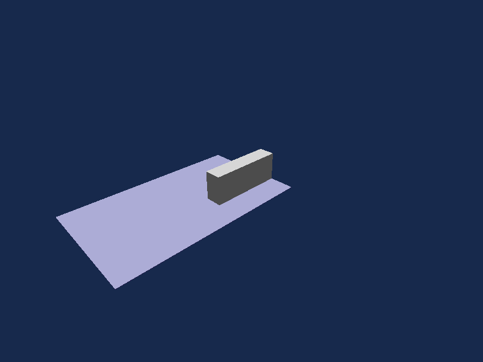

# Engine depth qualification — originating Studio KI-008

## Scope and source

Engine correction for camera-dependent missing/sliced Parts, based on Studio
evidence commits `c119968` and `6ed3f36`. Baseline Engine main is
`a68f76bbf9bc4d75bac1de40bdc7b8dc4837b2a1`; the affected render files match the
Studio-pinned Engine `7ff53be396221f225fdbfb375d0295353a6291ab`.
Engine's verified origin remains `gmoddev/gargantuan`; the Studio repository is
`GantriaEngine/gargantuan-studio`.

This receipt qualifies the bounded SDL/Vulkan Engine correction on Windows.
Studio, its pinned Engine, the live project, Dock UX Slice 7, Foundation 3L,
networking and shadow rendering are unchanged. No automatic merge is authorized.
Final source identity and hosted Windows/Linux results are the commit and checks
on the `fix/viewport-depth-ki008` branch/PR in
[Native engine CI](https://github.com/gmoddev/gargantuan/actions/workflows/native-ci.yml).
Do not treat GPU qualification below as a Linux GPU or multi-device claim.

## Reproduction and visibility oracle

The preserved [scene](assets/ki008/scene.instance.json) has SHA-256
`f755f8187a04bbc140fa2c58f9477eb3c63dc02b7f1b70641fd16c229ecc4fb2`.
It contains two opaque, axis-aligned Block Parts:

| Part | Center | Size | Color |
| --- | --- | --- | --- |
| Platform | (-50.125, 0, 74.25) | (205.75, 1, 341) | (0.5, 0.5, 1) |
| Block | (-10.5, 24, -28.75) | (30.5, 59, 135) | (1, 1, 1) |

Target is (-10.5, 15, -28.75), FOV 60°, aspect 800/600. Eye is
`Target + Distance * (cos(Angle), .55, sin(Angle))`; distances are 200, 500,
1000, 2000 and angles 0°, 45°, 90°. The second variant disables shadows; the
third scales both geometry and camera by 0.1, with shadows disabled.

`RendererDepthTests` uses real Parts, production `RenderPublisher`, the normal
viewport passes and raw CPU readback. Its independent double-precision ray/box
oracle finds the nearest block surface, erodes the silhouette by one pixel,
then checks neutral RGB coverage against the colored platform/background.
This excludes antialiasing/silhouette rounding from the correctness criterion.
It does not compare against a golden screenshot generated by the same renderer.

The current-source baseline reproduces **exactly** the prior Studio raw-frame
missing-pixel counts. The unchanged Studio probe was also run read-only against
the corrected EditorHost and preserved saved project: all 36 frames pass;
[result, frame hashes and executable hash](assets/ki008/editorhost-fixed.json).
No Studio file or live project was modified.

| Distance | Angle | Expected interior pixels | Baseline missing | Corrected missing |
| --- | --- | ---: | ---: | ---: |
| 200 | 0 | 47208 | 314 | 0 |
| 200 | 45 | 41666 | 297 | 0 |
| 200 | 90 | 22890 | 88 | 0 |
| 500 | 0 | 6770 | 734 | 0 |
| 500 | 45 | 6017 | 372 | 0 |
| 500 | 90 | 2792 | 196 | 0 |
| 1000 | 0 | 1568 | 360 | 0 |
| 1000 | 45 | 1404 | 287 | 0 |
| 1000 | 90 | 588 | 108 | 0 |
| 2000 | 0 | 350 | 170 | 0 |
| 2000 | 45 | 318 | 145 | 0 |
| 2000 | 90 | 132 | 72 | 0 |

All 36 lossless raw-frame PNGs per build are retained under
[`before`](assets/ki008/before/analysis.json) and
[`after`](assets/ki008/after/analysis.json), with per-frame hashes, depth ranges,
quantization predictions and representative failing pixels in the linked JSON.
Names are `Variant-Distance-Angle.png` (variant 0 original, 1 no shadows, 2 scaled).




## Actual depth path and attribution

The baseline runtime `SDLRenderer::Resize` and authoring
`EditorViewportRenderer::Backend::RecreateTargets` explicitly create
`SDL_GPU_TEXTUREFORMAT_D16_UNORM` depth-only attachments, without stencil.
Opaque and double-sided opaque pipelines explicitly use that same format.
The selected Windows SDL backend is Vulkan; SDL maps this to
`VK_FORMAT_D16_UNORM`. There is no Engine format negotiation or silent fallback.

Opaque pass binds that attachment, clears it to 1, enables depth testing and
writing with `LESS`, and discards its contents after the pass. Vertex shaders
use the published projection directly. This is conventional Z. Both camera
producers previously called macro-dependent `glm::perspective`; measured
production coefficients were the right-handed **minus-one-to-one** mapping:

`d(z) = (f+n)/(f-n) - 2*f*n/((f-n)*z)`

Here `n=.1`, `f=100000`, while SDL GPU's clip range is **0 ≤ clip.z ≤ clip.w**.
Therefore the actual near clipping distance was `2fn/(f+n)`, approximately
0.2 rather than 0.1. Neither near/far clipping nor culling explains the original
missing regions: their positive camera depths are hundreds/thousands, far
inside both clipping planes, and the same triangles render when only depth
precision changes. No geometry/winding/material/cull-state correction is used.

The platform is submitted before the block. Distinct surface depths collapse
into D16 bins; the later block fragments fail `LESS` against the platform.
For distance 500 / angle 45, pixel (447,295), independent ray intersections give:

| Quantity | Block | Platform |
| --- | ---: | ---: |
| Camera-space depth | 606.397980 | 610.333937 |
| Baseline mapped depth | .999672183270 | .999674310212 |
| Nearest D16 integer | 65514 | 65514 |

Separation is only **0.1394 D16 steps**, despite 3.936 units of surface
separation. At distance 2000 / angle 90, pixel (397,298), the surfaces are
2214.2754 and 2324.8327 units away (110.5573 apart), but both quantize to 65529.
The double-precision ideal D16 model exactly predicts the entire missing mask
in five original views. Other views differ at depth-bin boundaries because
the model does not simulate float vertex transforms, raster interpolation or
implementation rounding. It is not represented as a GPU depth-buffer readback.
The one-variable GPU experiment establishes causation beyond that correlation.

## Controlled experiments

Missing interior pixels summed over each 12-frame variant:

| Change from baseline | Original | Shadows off | Scale 0.1 |
| --- | ---: | ---: | ---: |
| D16, original projection/range | 3143 | 3143 | 48 |
| D16, explicit zero-to-one projection only | 4428 | 4428 | 268 |
| D16, near=1 only | 188 | 188 | 0 |
| D16, far=5000 only | 2629 | 2629 | 110 |
| D32 only, original projection/range | 0 | 0 | 0 |
| D32 + explicit zero-to-one, original range | 0 | 0 | 0 |

Logs: [baseline](assets/ki008/experiments/baseline.log),
[projection only](assets/ki008/experiments/zo-only.log),
[near only](assets/ki008/experiments/near-only.log),
[far only](assets/ki008/experiments/far-only.log),
[D32 only](assets/ki008/experiments/d32-only.log),
[retained correction](assets/ki008/experiments/fixed.log).

**A is the slicing cause; C is an independently demonstrated clipping defect.**
Changing the far plane does not solve it. Enlarging the near plane sacrifices
near visibility and still fails this matrix. Correct zero-to-one mapping alone
reduces distant D16 separation and is insufficient. D32 alone solves KI-008,
but preserves the incorrect near clip. Retaining both bounded corrections
restores coverage and the existing declared near/far contract. No camera policy
change, polygon offset, bias, fixture-specific geometry adjustment or reversed-Z
is introduced.

## Retained implementation and other passes

`SDLSceneDepth.hpp` is private to the SDL backend. One format constant and
checked texture descriptor serve editor/runtime target creation and recreation;
the opaque pipeline uses that same constant. D32 support is checked explicitly
before allocation. Unsupported devices fail clearly rather than downgrading.
The pre-existing independent shadow pass already requires D32 target/sampling
support, so this does not add a new format requirement to that qualified path.
On the tested RX 7900 XT, SDL reports D16=yes, D24=no, D32=yes. D24 was therefore
not an available alternative; no D24 fallback is claimed.

SDL's [GPU coordinate contract](https://wiki.libsdl.org/SDL3/CategoryGPU) defines
the zero-to-one clip range; its
[texture format contract](https://wiki.libsdl.org/SDL3/SDL_GPUTextureFormat)
requires querying optional D24/D32 support rather than assuming both exist.

Both full extraction and incremental publication now call
`glm::perspectiveRH_ZO` explicitly. This avoids translation-unit GLM macro
dependence. Projection remains right-handed/conventional; `LESS`, clear=1,
near=.1, far=100000 and viewport conventions are unchanged. Filament builds its
own projection from camera parameters and does not consume this matrix; no
Filament redesign or device qualification is claimed. Headless consumers still
consume immutable camera values. Animation visibility feedback's existing
near-plane test is conservative and does not perform raster depth testing.

The D32 shadow map is a separate 2048² texture, rendered using an orthographic
light camera. Its depth mapping, sampling and comparison are unchanged. That
independence explains why shadows can remain when main-view surfaces disappear.
Opaque/transparent material handling and draw ordering are unchanged; both
ordinary and double-sided pipelines use the same scene depth. Sky and GUI do
not use the main depth attachment. Studio selection/gizmos remain Studio-owned.
Edit and minimal Play reuse the viewport path; runtime uses the same passes.

Viewport resize retains complete replacement-before-release and full-resync
semantics. Runtime recreation uses the same format; format failure occurs
before replacement color allocation. No Engine/EditorHost protocol, public SDL
GPU types, object identity, persistent data or mutation authority changes.

## Resource and performance bounds

D16 uses 2 logical bytes/pixel; D32 uses 4, no stencil or additional texture.
Driver padding/compression is not included in these derived payload sizes.

| Resolution | Previous depth | Corrected depth | Increase |
| --- | ---: | ---: | ---: |
| 1920×1080 | 4,147,200 B | 8,294,400 B | 3.955 MiB |
| 2560×1440 | 7,372,800 B | 14,745,600 B | 7.031 MiB |
| 3840×2160 | 16,588,800 B | 33,177,600 B | 15.820 MiB |

During resize, old and replacement depth textures coexist: peak logical depth
bytes are `4*(oldPixels+newPixels)`, versus `2*(oldPixels+newPixels)` previously.
Shadow, color, transfer and protocol payload sizes are unchanged.

RX 7900 XT, driver 32.0.31035.1003, Windows Vulkan, Release, original two-Part
scene, shadow enabled; four warmups and 20 measured synchronous captures each:

| Size | Before median capture | After median capture | Before/after resize |
| --- | ---: | ---: | ---: |
| 1920×1080 | 5.531 ms | 6.045 ms | 6.527 / 4.025 ms |
| 2560×1440 | 10.397 ms | 9.696 ms | 12.220 / 16.962 ms |
| 3840×2160 | 20.261 ms | 20.408 ms | 22.487 / 21.025 ms |

These are end-to-end GPU capture/readback timings on a shared desktop, not GPU
timestamp or input-latency measurements. The mixed changes and resize variation
do not establish a speedup or a universal performance guarantee. There is no
large capture regression in this bounded fixture. This task does not claim to
resolve the user's separate mouse/viewport lag or Properties commit UX reports.

## Regression gates and commands

- Windows GPU: 36 exact scene/camera/scale/shadow cases, **0 missing pixels**.
- Saved-project EditorHost shared-memory capture: 36/36, **0 missing pixels**.
- Seven clipping/separation probes: near .15 visible, .05 clipped; separated
  surfaces at 1/.001, 500/.5, 2000/8 and 10000/256 distance/gap; 110000 clipped.
  All 169 interior samples per probe match expected visibility.
- Resizes 1920×1080 → 2560×1440 → 3840×2160 → 320×240 → 800×600: zero missing
  oracle pixels; runtime offscreen path submits all five frames.
- Native viewport smoke, Foundation tests and renderer-publication tests pass.
  Publication tests enforce near→0/far→1, monotonicity, outside clipping and
  identical full/incremental projections at both tested near/far settings.
- Existing Foundation 2 GPU fixture `--scenario=all --frames=8 --warmup=2
  --width=800 --height=600` passes deformable/topology, GUI/mixed, texture
  lifecycle, environment/restart, animation palette and main/shadow gates.
  CPU/GPU skinning differential has zero channel/pixel differences. This is a
  bounded rendering regression run, not a new performance foundation claim:
  [raw output](assets/ki008/experiments/gpu-regressions.log).
- GPU fixture asserts D32/LESS/depth-test/depth-write state. Successful production
  pipeline creation and rendering exercise attachment/pipeline compatibility.
- MSVC Release built remotely with six jobs, persistent incremental cache under
  `C:\Sandbox\Codex\Builds\gargantuan-ki008\msvc-release`. Worker MSVC 19.44 needs
  `CMAKE_DISABLE_PRECOMPILE_HEADERS=ON` to bypass its `/pathmap` PCH failure;
  production CMake flags are unchanged. Canonical MSVC 19.50+ and Linux
  ASan/UBSan/LSan are covered by final-source hosted Native CI, not this worker.

```powershell
# Generate and build using the repository's normal build instructions, with
# GARGANTUAN_BUILD_RENDERER_BENCHMARKS=ON. GPU test is intentionally not CTest.
gargantuan_renderer_depth_tests.exe --extended --output=<raw-frame-directory>
python tools/RendererDepthAnalysis.py <raw-frame-directory> --projection=zo
```

For controlled historical builds, `--observe` records expected failures;
`--near=1`, `--far=5000`, `--projection=zo` override only the diagnostic matrix.
Extended production probes always use the production camera contract. The
analysis tool requires NumPy/Pillow and does not import Studio.

## Limits and next task

Conventional floating depth remains finite. An exploratory two-unit gap at
distance 2000 failed even with D32 and the original mapping; the regression
gate uses an eight-unit gap there and records the earlier failure in the D32
experiment log. Arbitrarily close distant surfaces, coplanar z-fighting, huge
world coordinates, and the entire .1…100000 range at sub-unit separation are
not claimed solved. Reversed-Z would be a separate architecture decision;
the observed KI-008 fixture does not require it.

The user's total-disappearance screenshot was not independently reproduced;
this qualification covers the deterministic lost-surface/slicing matrix, not
every possible cause of disappearance. Other GPUs/APIs and native Studio
presentation remain follow-up qualification boundaries.

**Engine KI-008 fixture: corrected and Windows raw-render qualified.** After
review/merge, the exact Studio task is to update its pinned Engine to the merged
fix, verify artifact provenance, repeat the preserved two-Part camera matrix in
native Studio, then update Studio KI-008's receipt/status from those results.
Only after that should Dock UX Slice 7's remaining physical matrix resume.
